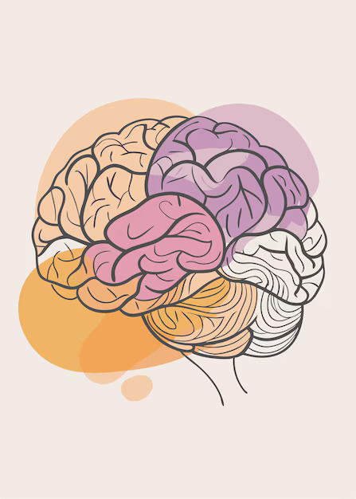

# CancerScan - Brain MRI Classifier

CancerScan is an AI-powered web application designed to classify brain MRI scans. It helps in identifying the type of brain tumors (Glioma, Meningioma, Pituitary) or indicate the absence of them.
This tool provides quick, preliminary insights based on machine learning predictions, aiming to assist in early detection and understanding of MRI results. The model was pre-trained on roboflow and implemented on our own website using their api.

**Disclaimer:** This AI prediction is for informational purposes only and is not a substitute for professional medical advice, diagnosis, or treatment. Always consult a qualified healthcare professional for any health concerns.

## Live Application

You can access the live CancerScan application here:
<https://cancer-scan.vercel.app/>

## Features

* **Intuitive Image Upload:** Easily upload brain MRI images via drag-and-drop or a click-to-upload button.

* **Real-time Preview:** Instantly view the uploaded MRI scan within the application.

* **AI-Powered Classification:** Utilizes a pre-trained machine learning model to classify MRI scans into one of four categories:

    * **No Tumor**

    * **Pituitary Tumor**

    * **Meningioma Tumor**

    * **Glioma Tumor**

* **Confidence Score:** Displays the confidence level of the models's prediction.

* **AI Review & Next Steps:** Provides general insights and recommendations based on the result.

* **Responsive Design:** Extremly lightweight and friendly to use across various devices (desktop, tablet, mobile).

## Technologies Used

* **HTML**

* **CSS**

* **JavaScript**

* **Roboflow**

## Usage

1.  **Upload Image:** Click the "Click to Upload" button or drag and drop your brain MRI image into the designated area.

2.  **View Prediction:** The uploaded image will be displayed, and the model will process it. The prediction result will appear below.

3.  **Read AI Review:** Get general AI-reviewed insights and next steps to fllow.

## Credits

* **Logo:** The "Brain One Line Art" logo used in this project is created by [upklyak](https://www.freepik.com/author/upklyak) and sourced from [Freepik](https://www.freepik.com/premium-vector/one-line-art-human-brain-drawing-abstract-minimal-continuous-line-wall-decor_275079935.htm).
